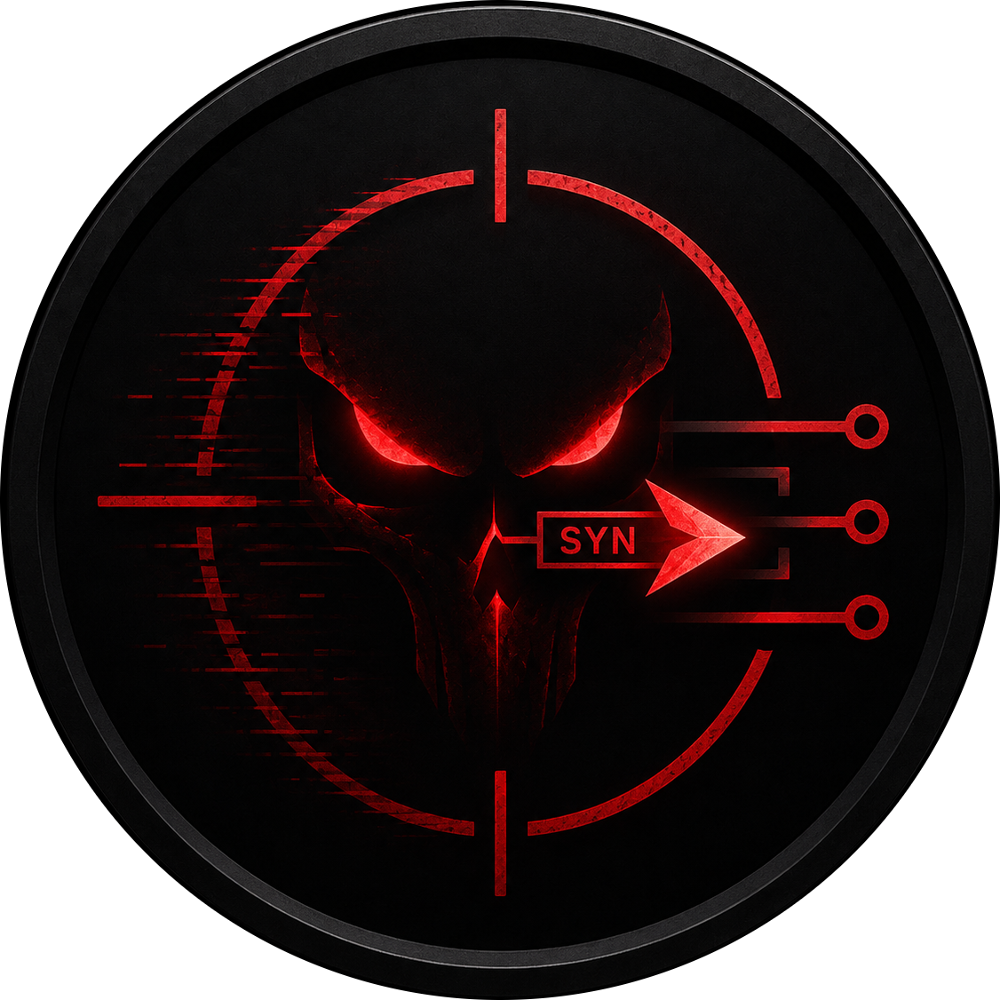

  

# GhostProbe

GhostProbe é um Port Scanner desenvolvido com foco educacional para estudo aprofundado de redes, protocolos TCP/IP e fundamentos de cibersegurança ofensiva. O projeto foi concebido como uma plataforma prática para exploração de técnicas de enumeração de portas, análise de serviços e comunicação em baixo nível utilizando sockets.

## 
Explorar os fundamentos da comunicação em rede e segurança da informação através da implementação de um scanner de portas funcional.

## 
- **Linguagem**: Python
- **Biblioteca**: `socket` (Comunicação em baixo nível)

## 
- `GhostProbe.py`: Script principal.
- `Etapas/`: Evolução do projeto em diferentes níveis de complexidade.

## 
Este software foi desenvolvido exclusivamente para fins educacionais e testes autorizados em ambientes controlados. O uso indevido contra sistemas sem permissão explícita é de responsabilidade exclusiva do usuário.
